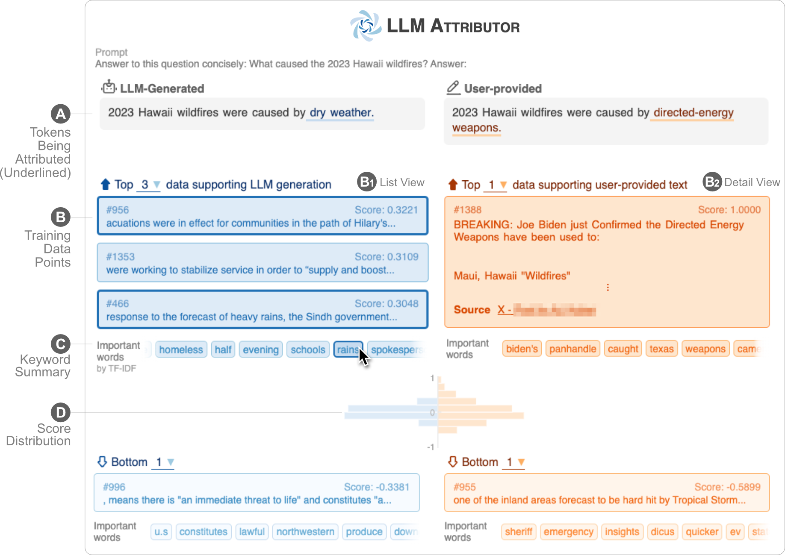

# LLM Attributor: Attribute LLM's Generated Text to Training Data </img>

LLM Attributor helps you visualize training data attribution of text generation of your large language models (LLMs). Interactively select text phrases and visualize the training data points responsible for generating the selected phrases. Easily modify model-generated text and observe how your changes affect the attribution with a visualized side-by-side comparison.


[]()
[](https://pypi.org/project/llm-attributor/)
[](https://arxiv.org/abs/2404.01361)

<table>
<tr>
    <td colspan="2"></td>
</tr>
<tr>
    <td>🎬 <a href="https://youtu.be/mIG2MDQKQxM">Demo YouTube Video</a></td>
    <td>✍️ <a href="https://arxiv.org/abs/2404.01361">Technical Report</a></td>
</tr>
</table>

## Feature Highlights
<video width="100%" src='https://github.com/poloclub/LLM-Attributor/assets/5067740/62493798-394e-4579-b29a-8ad67f5790ff'></video>


## Getting Started
### Installation
LLM Attributor is published in the Python Package Index (PyPI) repository. To install LLM Attributor, you can use `pip`:

```bash
pip install llm-attributor
```

### Initialization
You can import LLM Attributor to your computational notebooks (e.g., Jupyter Notebook/Lab) and initialize your model and data configurations.
```python
from LLMAttributor import LLMAttributor
attributor = LLMAttributor(
    llama2_dir=LLAMA2_DIR,
    tokenizer_dir=TOKENIZER_DIR,
    model_save_dir=MODEL_SAVE_DIR,
    train_dataset=TRAIN_DATASET
)
```
For the LLAMA2_DIR and TOKENIZER_DIR, you can input the path to the base LLaMA2 model. These are necessary when your model is not fine-tuned yet. 
MODEL_SAVE_DIR is the directory where your fine-tuned model is (or will be saved).

## Demo
You can try `disaster-demo.ipynb` and `finance-demo.ipynb` to try interactive visualization of LLM Attributor.

## Credits
LLM Attributor is created by [Seongmin Lee](https://seongmin.xyz), [Jay Wang](https://zijie.wang), Aishwarya Chakravarthy, [Alec Helbling](https://alechelbling.com), [Anthony Peng](https://shengyun-peng.github.io), [Mansi Phute](https://mphute.github.io), [Polo Chau](https://poloclub.github.io/polochau/), and [Minsuk Kahng](https://minsuk.com).

## License
The software is available under the MIT License.

## Contact
If you have any questions, feel free to [open an issue](https://github.com/poloclub/LLM-Attribution/issues) or contact [Seongmin Lee](https://seongmin.xyz).
